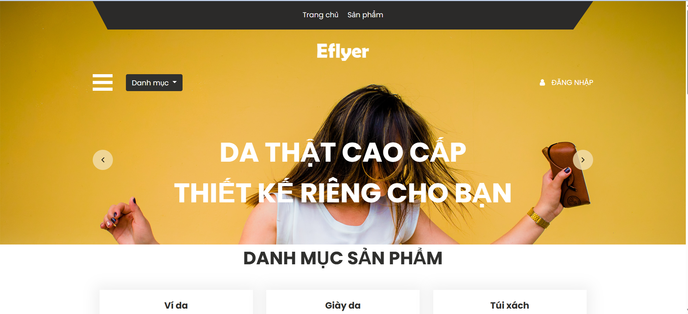
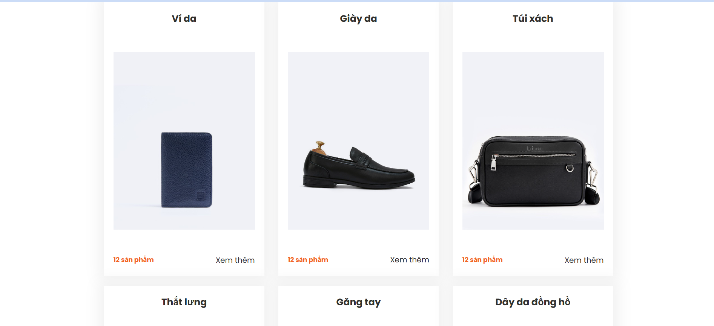
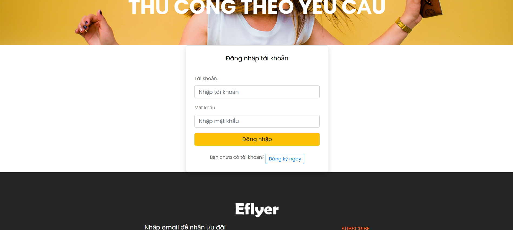
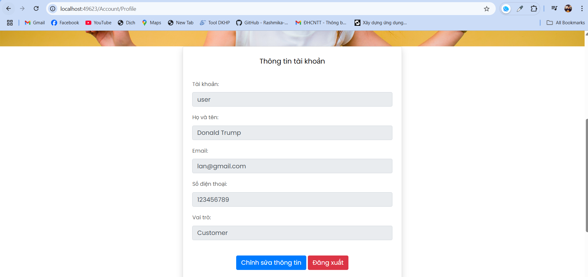
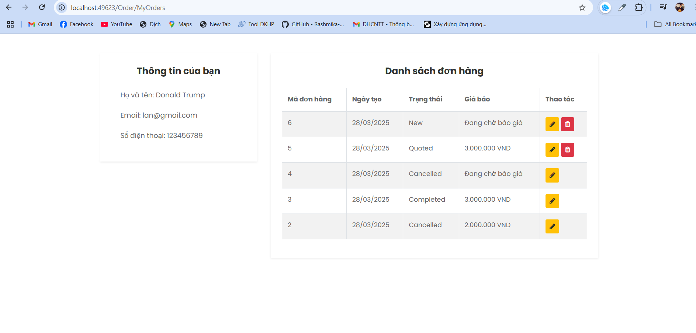
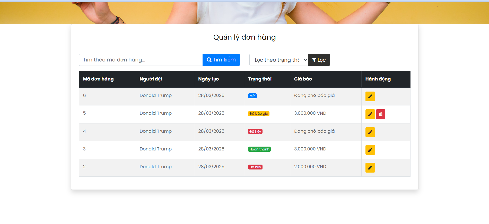
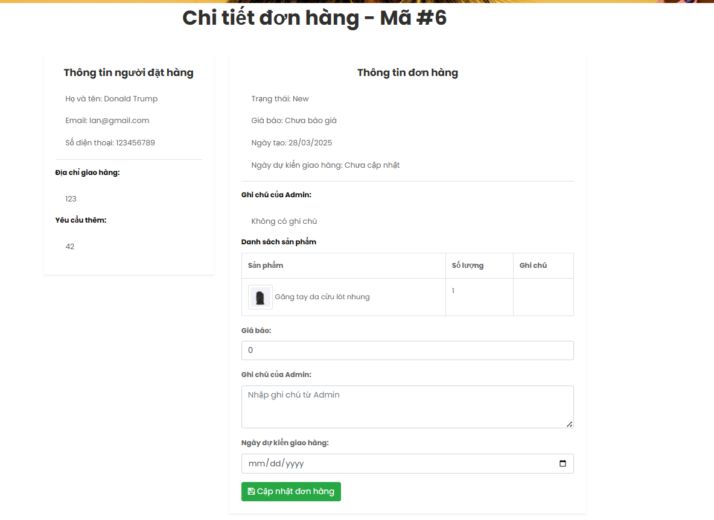
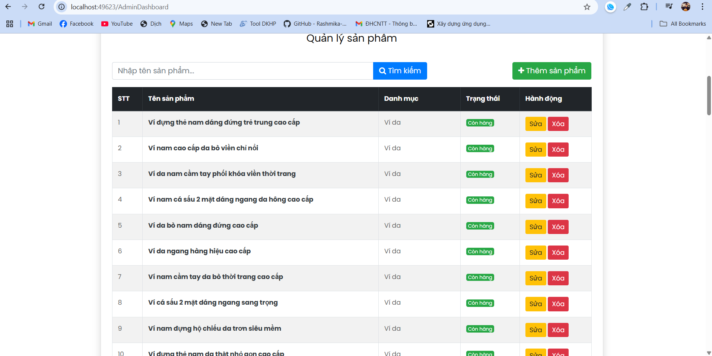

# 👜 TailoredLeatherShop

**TailoredLeatherShop** is a made-to-order leather product web application developed with **ASP.NET MVC Framework**, **Entity Framework**, and **SQL Server**. Instead of traditional fixed-price purchases, customers submit custom requests, receive quotations from sellers, and proceed with the order if they agree on the price.

---

## 🧩 Table of Contents

- [Features](#-features)
- [Technology Stack](#-technology-stack)
- [Screenshots & Pages Overview](#-screenshots--pages-overview)
- [Installation Guide](#-installation-guide)
- [License](#-license)
- [Contact](#-contact)

---

## 🚀 Features

- View leather products without login
- Customer registration & login
- Place custom orders without predefined pricing
- Admin reviews request & sends quotation
- Customer accepts or cancels quotation
- Admin prepares & delivers the order
- Order status tracking
- Admin dashboard for product & order management

---

## 🛠 Technology Stack

- ASP.NET MVC Framework
- Entity Framework
- SQL Server
- HTML5, CSS3, JavaScript, Bootstrap
- Visual Studio 2022+

---

## 🖼 Screenshots & Pages Overview

### 🏠 Home Page

Displays featured leather products grouped by category. Open for all visitors.



---

### 🔐 Login & Register

Separate login for **Customer** and **Admin**. Authentication via email and password.



---

### 👤 Account Management

View and edit customer profile, track orders.



---

### 📦 My Orders (Customer)

Track all submitted orders, quotation status, accept/reject option, and cancellation (if allowed).



---

### 📋 Admin – Order Management

Admin views all orders, provides quotation and notes, updates delivery status.




---

### 👜 Admin – Product Dashboard

Manage leather product catalog, categories, materials, availability, and images.



---

## 🧑‍💻 Installation Guide

### 🔧 Prerequisites

- Visual Studio 2022 or later
- Microsoft SQL Server (2019+ or SQL Server Express)
- .NET Framework 4.7+ (included in Visual Studio)

---

### 📥 Step-by-step Setup

#### 1. Clone the Repository

```bash
git clone https://github.com/tuanlanvidai/TailoredLeatherShop.git
cd TailoredLeatherShop/src
```
#### 2. Open the Solution

- Launch `TailoredLeatherShop.sln` using Visual Studio.

#### 3. Set Up the Database

- Open **SQL Server Management Studio (SSMS)**.
- Create a new database named: `TailoredLeatherDb`.
- Run the SQL script located at:  
  `../database/QueryDatabase.sql`

#### 4. Update Connection String (if using EF Designer)

If you're using **Entity Framework Designer from Database**:

- Right-click the `Models` folder → `Add` → `New Item...` → Choose `ADO.NET Entity Data Model`
- Select **EF Designer from database**
- Connect to your SQL Server and select the `TailoredLeatherDb` database
- Choose the tables to include and complete the wizard

This will automatically generate a connection string in your `Web.config` like below:

```xml
<connectionStrings>
  <add name="handbagShopDBEntities" 
       connectionString="metadata=res://*/Models.HandbagShopModel.csdl|res://*/Models.HandbagShopModel.ssdl|res://*/Models.HandbagShopModel.msl;provider=System.Data.SqlClient;provider connection string=&quot;data source=.\SQLEXPRESS;initial catalog=TailoredLeatherDb;integrated security=True;MultipleActiveResultSets=True;App=EntityFramework&quot;" 
       providerName="System.Data.EntityClient" />
</connectionStrings>
```

#### 5. Run the Application

- In Visual Studio, press `Ctrl + F5` or click **Start Without Debugging**.
- The website will launch in your default browser.

---
## 📄 License

This project is licensed under the **MIT License**.  
See the [LICENSE](./LICENSE) file for details.

---

## 📬 Contact

For questions or collaboration, please contact:

**Lan Truong**  
📧 [lantruongtuan333@gmail.com](mailto:lantruongtuan333@gmail.com)  
---
